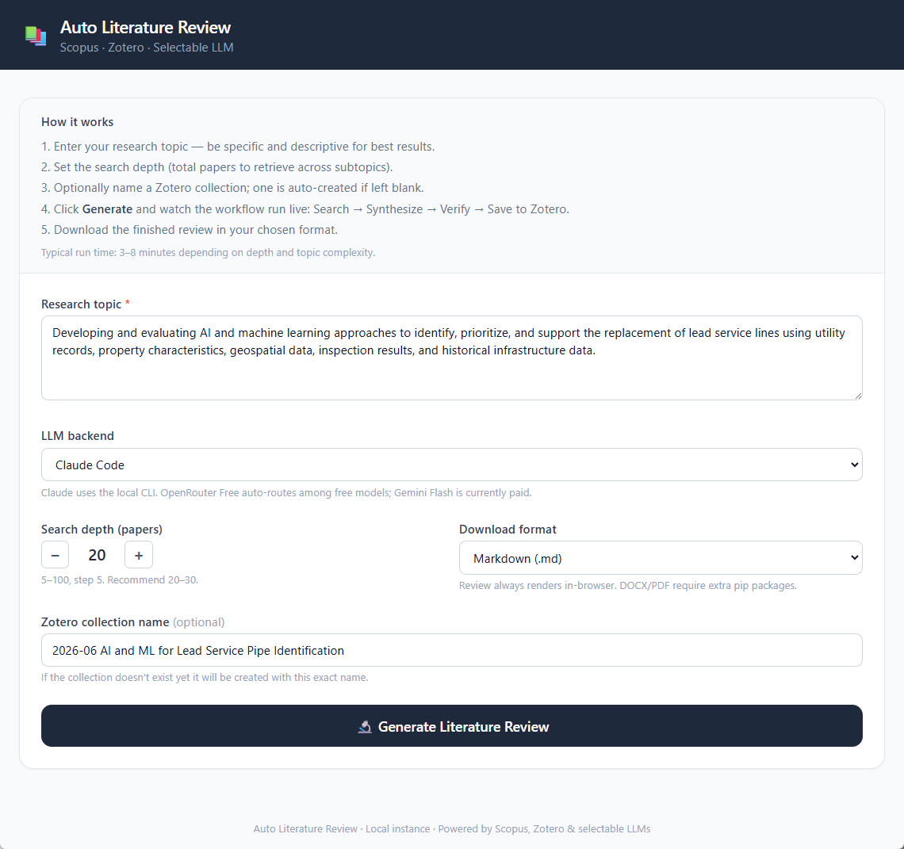
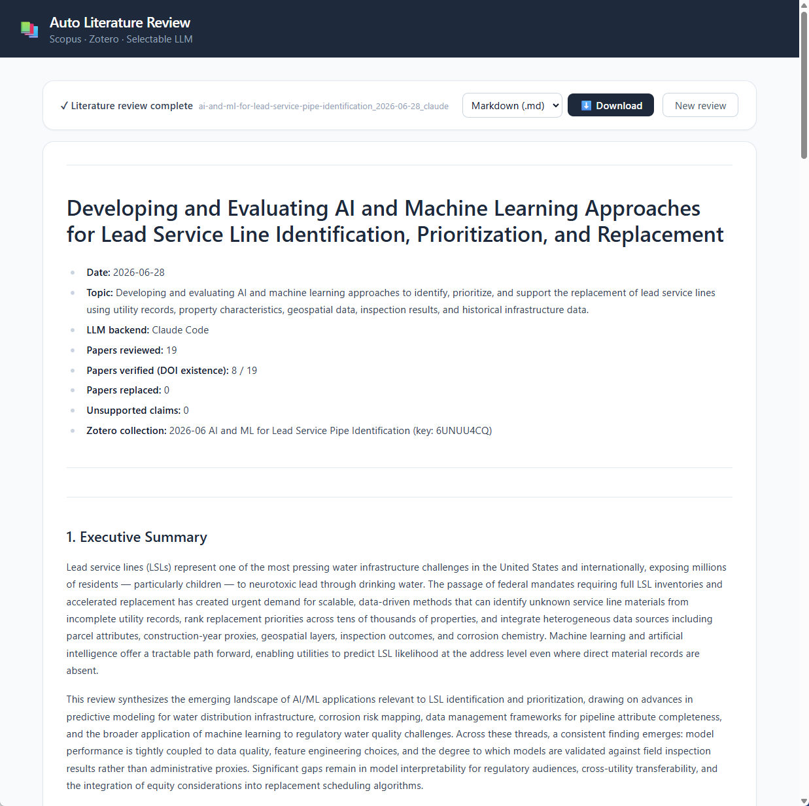
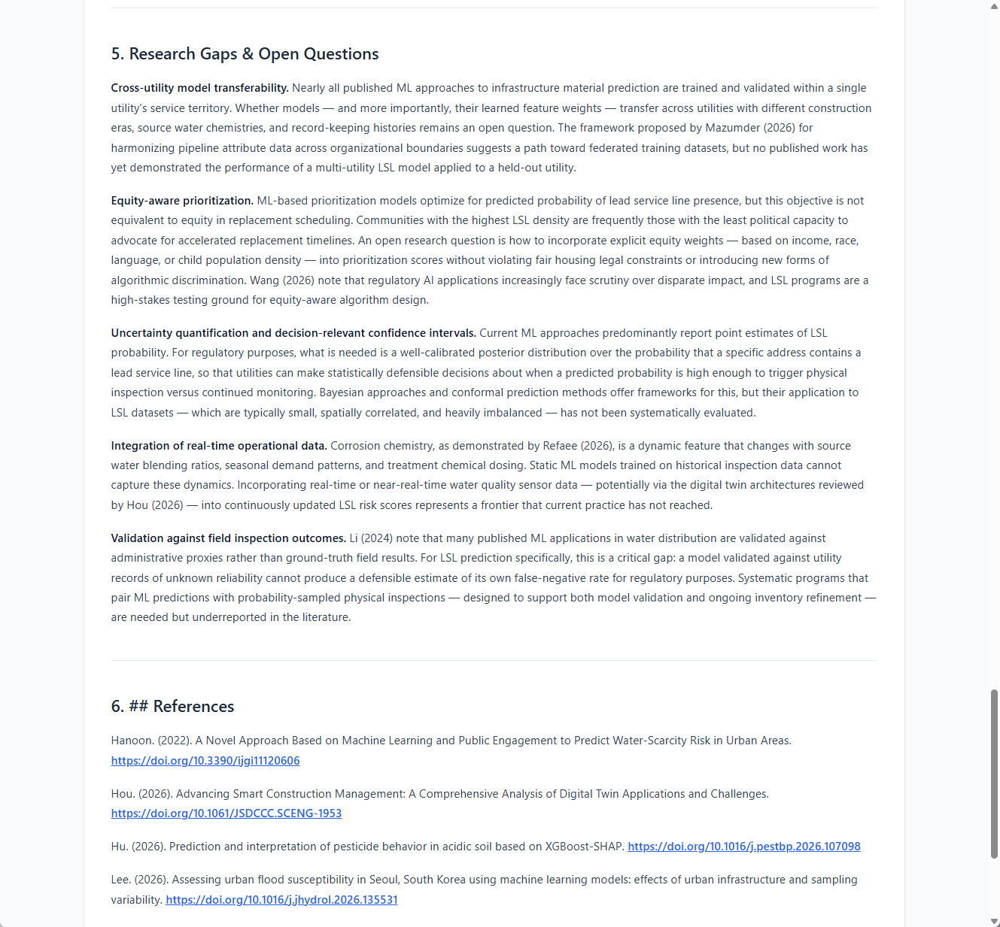

# Automated Literature Review App with Scopus, Zotero, and Selectable LLM Backends

End-to-end research automation app that searches Scopus, synthesizes literature reviews with selectable LLM backends, verifies cited DOIs, saves verified papers to Zotero, and exports AGU-style review documents.

---

## Project Highlights

- **Task:** Automated scientific literature review generation
- **Domain:** Hydrology, climate, infrastructure, and environmental literature review workflows
- **Objective:** Reduce manual literature-review overhead while preserving citation traceability
- **Core workflow:** Scopus search -> LLM synthesis -> DOI verification -> Zotero save -> AGU bibliography export
- **LLM options:** Claude Code, OpenRouter Free Router, Gemini Flash, Qwen3 Coder, NVIDIA Nemotron Ultra, NVIDIA Nemotron Super
- **Outputs:** Markdown, Word, and PDF review documents
- **Provenance:** Final metadata records selected LLM backend, DOI verification count, Zotero collection, and assigned OpenRouter model when using `openrouter/free`

This project demonstrates practical GenAI application engineering: API integration, model fallback design, citation verification, document export, and a usable frontend for research workflows.

---

## Motivation & Problem Statement

Scientific literature reviews are slow to produce because they require several different kinds of work:

- finding relevant papers
- screening abstracts and metadata
- synthesizing themes across studies
- keeping citations grounded and traceable
- formatting references consistently
- saving reviewed papers to a citation manager

Generic LLM chat workflows can draft prose quickly, but they often lose citation provenance, invent references, or fail to connect generated claims to verifiable source metadata.

The goal of this project is to build a local research assistant that combines LLM synthesis with structured scholarly APIs and citation-management tooling. The app is designed to make literature review generation more repeatable, inspectable, and operationally useful.

---

## Application Screenshots

### Review Setup Interface

The user enters a research topic, selects an LLM backend, chooses search depth and output format, and optionally provides a Zotero collection name.



### Generated Review With Metadata

The final report includes metadata for the run, including topic, backend LLM, papers reviewed, verified citations, and Zotero collection key.



### Research Gaps and References

The app produces thematic synthesis, research gaps, open questions, and an AGU-style bibliography exported from Zotero.



---

## System Workflow

```text
User topic
   |
   v
LLM-generated concise Zotero title
   |
   v
LLM topic decomposition into Scopus subtopics
   |
   v
Scopus search + DOI deduplication
   |
   v
LLM literature review synthesis
   |
   v
Parse CITED_DOIS marker
   |
   v
Scopus DOI existence verification
   |
   v
Save verified papers to Zotero
   |
   v
Export AGU bibliography
   |
   v
Markdown review + DOCX/PDF download
```

---

## Key Features

### Selectable LLM Backends

The app lets the user choose the model provider per run:

| UI Label | Backend ID | Notes |
| --- | --- | --- |
| Claude Code | `claude` | Uses local `claude -p`; requires Claude Code CLI authentication |
| OpenRouter Free Router (auto) | `openrouter_free` | Uses `openrouter/free`; requests a free long-context text model suitable for literature synthesis |
| Gemini 2.5 Flash (OpenRouter paid) | `gemini_flash` | Uses OpenRouter model `google/gemini-2.5-flash` |
| Qwen3 Coder 480B A35B (free) | `qwen3_coder_free` | Uses OpenRouter model `qwen/qwen3-coder:free` |
| NVIDIA Nemotron 3 Ultra (free) | `nemotron_ultra_free` | Uses OpenRouter model `nvidia/nemotron-3-ultra-550b-a55b:free` |
| NVIDIA Nemotron 3 Super (free) | `nemotron_super_free` | Uses OpenRouter model `nvidia/nemotron-3-super-120b-a12b:free` |

When `openrouter_free` is selected, the app records both the selected router and the model OpenRouter reports it assigned to the synthesis call.

Example metadata:

```markdown
- **LLM backend:** OpenRouter Free Router (auto) (selected: openrouter/free; assigned: qwen/qwen3-coder:free)
```

### Citation Grounding

The synthesis prompt requires a final `CITED_DOIS` marker. The backend parses this marker, verifies DOI existence through Scopus, and uses the verified paper set for Zotero saving and bibliography export.

### Zotero Integration

The app can:

- create a new Zotero collection
- resume an existing collection by name
- skip duplicate DOIs already in the collection
- add verified papers to Zotero
- export a bibliography in American Geophysical Union style

### Operational UX

The local dev workflow includes:

- automatic browser opening after `npm run dev`
- terminal instructions for shutdown
- live frontend progress updates
- clearer API errors for stale servers, model limits, and non-stream responses
- output filenames with brief topic, date, and backend code

Example output filename:

```text
sebou-basin-climate-and-water-risk_2026-06-28_orfree.md
```

---

## Tech Stack

- **Frontend:** Next.js, React, Tailwind CSS
- **Backend:** FastAPI, Python async workflow orchestration
- **LLM backends:** Claude Code CLI, OpenRouter Chat Completions API
- **Scholarly search:** Scopus API
- **Citation manager:** Zotero API
- **Documents:** Markdown, python-docx, WeasyPrint
- **Dev tooling:** npm, concurrently, pytest

---

## Repository Structure

```text
.
├── api/
│   ├── main.py                        # FastAPI app, SSE /api/review, /api/download
│   ├── workflow.py                    # Review workflow and selectable LLM backends
│   └── convert.py                     # Markdown to DOCX/PDF conversion
├── frontend/
│   ├── app/page.tsx                   # Main UI and SSE consumer
│   ├── components/ReviewForm.tsx      # Form, backend selector, run controls
│   ├── components/ProgressPanel.tsx   # Live workflow progress
│   ├── components/ReviewOutput.tsx    # Rendered review and download controls
│   └── next.config.mjs                # Proxies /api/* to 127.0.0.1:8000
├── mcp_servers/
│   ├── scopus_mcp/server.py           # Scopus and ScienceDirect MCP server
│   └── zotero_mcp/server.py           # Zotero MCP server
├── prompts/
│   └── lit_review_runtime_prompt.md   # Claude Code CLI prompt template
├── scripts/
│   ├── dev-instructions.js            # Prints localhost and Ctrl+C shutdown help
│   └── open-dev-browser.js            # Opens localhost:3000 when ready
├── visuals/                           # README screenshots
├── outputs/                           # Generated reviews, gitignored
├── secrets/                           # API keys, gitignored
├── package.json
├── requirements.txt
└── README.md
```

---

## Local Setup

### 1. Create the Python environment

```powershell
py -3.12 -m venv .venv
.venv\Scripts\activate
pip install -r requirements.txt
```

### 2. Install JavaScript dependencies

```powershell
npm install
npm --prefix frontend install
```

### 3. Add API keys

Create `secrets/keys.txt`:

```text
SCOPUS_API_KEY=<your Elsevier API key>
ZOTERO_API_KEY=<your Zotero API key>
ZOTERO_USER_ID=<your Zotero numeric user ID>
OPENROUTER_API_KEY=<your OpenRouter API key, optional unless using OpenRouter backends>
```

`secrets/keys.txt` is excluded from Git.

### 4. Install AGU citation style in Zotero

In Zotero, install the `American Geophysical Union` citation style:

```text
Edit -> Settings -> Cite -> Styles -> Get additional styles
```

---

## Running the App

From the project root:

```powershell
.venv\Scripts\activate
npm run dev
```

This starts:

- FastAPI backend on `http://127.0.0.1:8000`
- Next.js frontend on `http://localhost:3000`
- automatic browser opening
- terminal shutdown instructions

To stop the app:

```text
Ctrl+C
```

---

## Outputs

The app saves the canonical review as Markdown:

```text
outputs/<brief-topic-slug>_<YYYY-MM-DD>_<llm-code>.md
```

The browser download button can export:

- Markdown (`.md`)
- Word (`.docx`)
- PDF (`.pdf`)

The final review includes:

- run metadata
- executive summary
- background and scope
- thematic synthesis
- key papers table
- research gaps and open questions
- AGU bibliography

---

## Reproducibility & Best Practices

This project is designed around reproducible research automation:

- API keys are isolated in `secrets/keys.txt`
- generated outputs are excluded from Git
- Zotero collection metadata is recorded in the final report
- LLM backend and OpenRouter-assigned model are recorded in metadata
- DOI verification is separated from prose generation
- frontend, backend, and conversion logic are modularized

Recommended checks:

```powershell
.venv\Scripts\activate
pytest mcp_servers/scopus_mcp/tests/ -v
pytest mcp_servers/zotero_mcp/tests/ -v
python -m py_compile api\workflow.py api\main.py
npm --prefix frontend run build
```

---

## Troubleshooting

### Stale FastAPI Server

If the UI reports a `422` error saying `openrouter_free` is not allowed, an old backend process is still running. Stop the app with `Ctrl+C`, make sure ports `8000` and `3000` are clear, and restart:

```powershell
npm run dev
```

### Claude Session Limits

If Claude fails with `Claude Code session limit reached`, wait until the reset time shown by Claude or switch to an OpenRouter backend.

### OpenRouter Free Model Capacity

Free OpenRouter routes can be temporarily overloaded by their upstream provider. If you see `ResourceExhausted`, `rate limit`, or `Retry after`, wait briefly or choose another backend.

### PDF Export

PDF conversion uses WeasyPrint. If PDF export fails due to system dependencies, use Markdown or DOCX.

---

## Portfolio Relevance

This project highlights:

- applied GenAI product engineering
- scientific-literature automation
- API integration with Scopus and Zotero
- citation-grounded LLM workflow design
- fallback model routing and LLM provenance tracking
- FastAPI and Next.js full-stack development
- practical document export and research workflow UX

It builds on earlier multi-agent literature-review prototypes and productizes the workflow into a local web app with real scholarly-data integrations.

---

## Disclaimer

This project is for research and portfolio demonstration purposes. Generated reviews should be manually checked before use in academic, regulatory, engineering, or policy decisions. Scopus, Zotero, Claude, OpenRouter, Gemini, Qwen, and NVIDIA model availability and terms may change over time.

---

## Author

Husayn El Sharif  
Senior Data Scientist / Machine Learning Engineer
